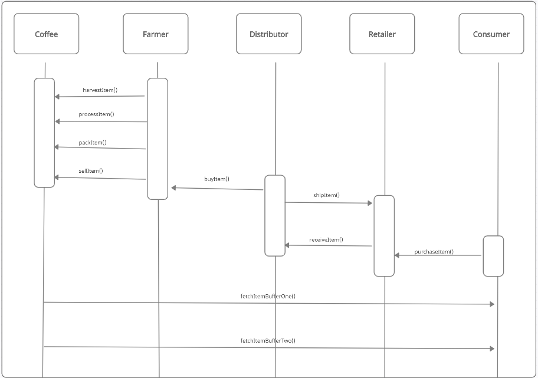
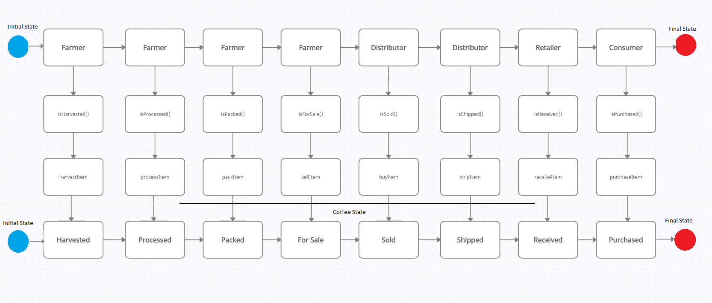
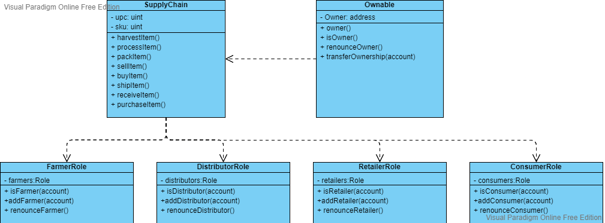

# Course 3 Project: Blockchain Architecture - Build Ethereum Dapp for Tracking Items through Supply Chain

For this project, you will creating a DApp supply chain solution backed by the Ethereum platform. You will architect smart contracts that manage specific user permission controls as well as contracts that track and verify a product’s authenticity.

## Project write-up - UML

### Activity

### Sequence

### State

### Class (Data Model)

### Project write-up - IPFS
Not used

### Rinkyby details
* The contract address: [0x3703c8156663477ba2fd5fb576bea9259b95f873](https://rinkeby.etherscan.io/address/0x3703c8156663477ba2fd5fb576bea9259b95f873)

### Libraries details:
* node version number : v16.13.0
* Truffle version number : v4.1.14
* web3 version number : v1.6.1
* program version: V 1.0

