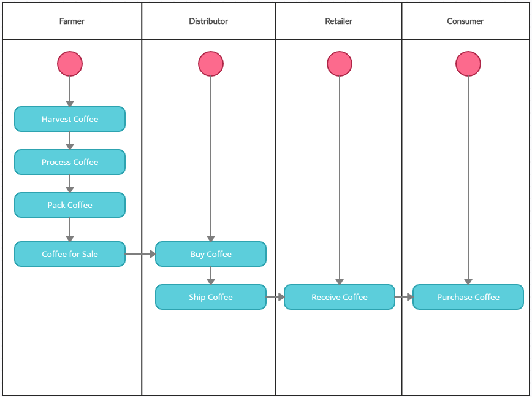

# Course 3 Project: Blockchain Architecture - Build Ethereum Dapp for Tracking Items through Supply Chain

For this project, you will creating a DApp supply chain solution backed by the Ethereum platform. You will architect smart contracts that manage specific user permission controls as well as contracts that track and verify a product’s authenticity.

## Project write-up - UML

### Activity

### Sequence

### State

### Class (Data Model)

### Project write-up - IPFS
Not used

### Rinkyby details
* The contract address: [0x3703c8156663477ba2fd5fb576bea9259b95f873](https://rinkeby.etherscan.io/address/0x3703c8156663477ba2fd5fb576bea9259b95f873)

* Transaction Id: [0x8593ea54027478743de824a7c5c1efc5cfb892b26095f1ba7bdb40219f76c15d](https://rinkeby.etherscan.io/tx/0x8593ea54027478743de824a7c5c1efc5cfb892b26095f1ba7bdb40219f76c15d)

### Libraries details:
* node version number : v16.13.0 for setting up and running the front end web server
* Truffle version number : v4.1.14 framework for faster development and deployment of ethereum contratcs based out of solidity
* web3 version number : v1.6.1 plugin for interacting with local / remote ethereum nodes
* program version: V 1.1 

